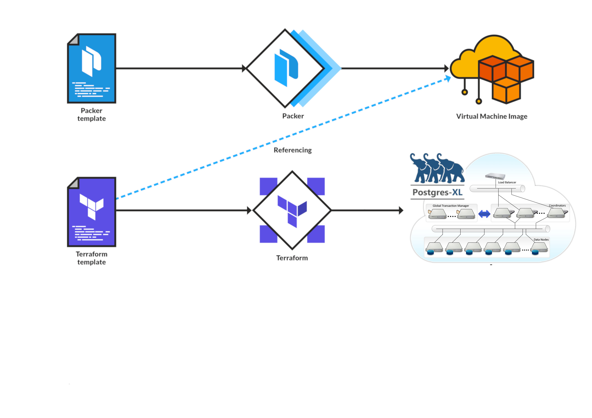

# autoscaling_geoprocessing

## Project Idea 
An autoscalable infrastructure ready to respond to processes with small extensions and escalate in resources to complete processes with any geographical extension. 

## Which technologies are well-suited to solve those challenges?
Packer, Terraform, Postgres-XL, PostGIS, Docker

## Pipeline

